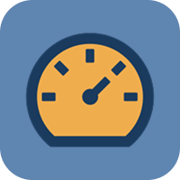

<h1 align="center">
  
</h1>

<p align="center">
  

 
</p>


## 💻 Projeto
Dashboard de Métricas: Monitoramento de Ingressantes


## :hammer_and_wrench: Features 

-   [x] Autenticação via api (e-mail e senha)
-   [x] Sidebar com carregamento dos dados do usuário logado
-   [x] Tela de login
-   [x] Tela de Home que mostra gráficos de ingressantes no curso 
-   [x] Cadastro de novo ingressante
-   [x] Troca de tema Dark e Light
-   [x] System-UI personalizada
	- Avatar
	- Breakpoints
	- Button
	- Calendar
	- Card
	- Dialog
	- Input de texto
	- Input select
	- Skeleton Loader
	- SwitchThemeButton


## ✨ Tecnologias

-   [x] React
-   [x] Vite
-   [x] Vitest
-   [x] Styled-components
-   [x] Typescript
-   [x] Context API
-   [x] Async Storage


## Executando o projeto

Utilize o **yarn install** ou o **npm install** para instalar as dependências do projeto.
Em seguida, inicie o projeto.

```cl
yarn dev ou yarn vite
```
Para iniciar o projeto e torna-lo **acessível pelo celular** rode no terminal
```cl
yarn dev --host ou yarn vite --host
```
Abra o projeto no navegador com a **url**
```cl
http://localhost:5173
```

Para rodar os teste o **yarn test** ou o **npm run test**

## 📄 Licença

Esse projeto está sob a licença MIT. Veja o arquivo [LICENSE](LICENSE.md) para mais detalhes.

<br />

<div align="center">
  <small>Desenvolvido por Carlos Eduardo - Fevereiro/2026</small>

  [](https://www.linkedin.com/in/carlos-eduardo19/) 
</div>
